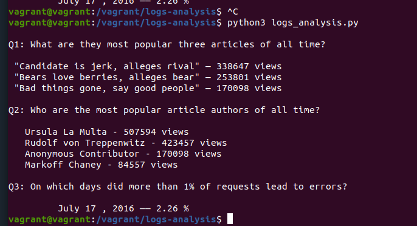

# Udacity Full Stack Developer Log Analysis
#### Oscar Vial, 2019
---

## Introduction to challenge
You've been hired onto a team working on a newspaper site. The user-facing newspaper site frontend itself, and the database behind it, are already built and running. You've been asked to build an internal reporting tool that will use information from the database to discover what kind of articles the site's readers like.

The database contains newspaper articles, as well as the web server log for the site. The log has a database row for each time a reader loaded a web page. Using that information, your code will answer questions about the site's user activity.

The program you write in this project will run from the command line. It won't take any input from the user. Instead, it will connect to that database, use SQL queries to analyze the log data, and print out the answers to some questions.

---

## Prerequisites
        
        Virtual Box 5.8.0
        Vagrant
        Text Editor of choice
        Download VM source code as zip or clone from provided git repo

- In the **Vagrant** folder of provided code run the following
        
        $: vagrant up

        $: vagrant ssh

 
 NOTE: The vagrant virtual machine may not start in the **vagrant** shared folder if so run 

            cd ../../vagrant

---
## Setup

- Make sure you have newsdata.sql, the SQL script file with all the data. It can be downloaded from the Udacity course page.

- Then run the following command to execute it in news database. You might have to create the database before-hand.

        psql -d news -f newsdata.sql

- Finally run the script.

        python3 logs_analysis.py

- It will present you with necessary stats.

---
## Question 1
- **What are the most popular three articles of all time?** Which articles have been accessed the most? Present this information as a sorted list with the      most popular article at the top.
### Output
``` 
What are they most popular three articles of all time?

 "Candidate is jerk, alleges rival" — 338647 views
 "Bears love berries, alleges bear" — 253801 views
 "Bad things gone, say good people" — 170098 views
```
---

## Question 2
- **Who are the most popular article authors of all time?** That is, when you sum up all of the articles each author has written, which authors get the most page views? Present this as a sorted list with the most popular author at the top.
- Output
```md
Who are the most popular article authors of all time?

   Ursula La Multa - 507594 views
   Rudolf von Treppenwitz - 423457 views
   Anonymous Contributor - 170098 views
   Markoff Chaney - 84557 views
```
---
## Question 3
 - **On which days did more than 1% of requests lead to errors?** The log table includes a column status that indicates the HTTP status code that the news site sent to the user's browser.
 - Results
 ```
  July 17 , 2016 —— 2.26 %
```
---
## Overall Expected Output
